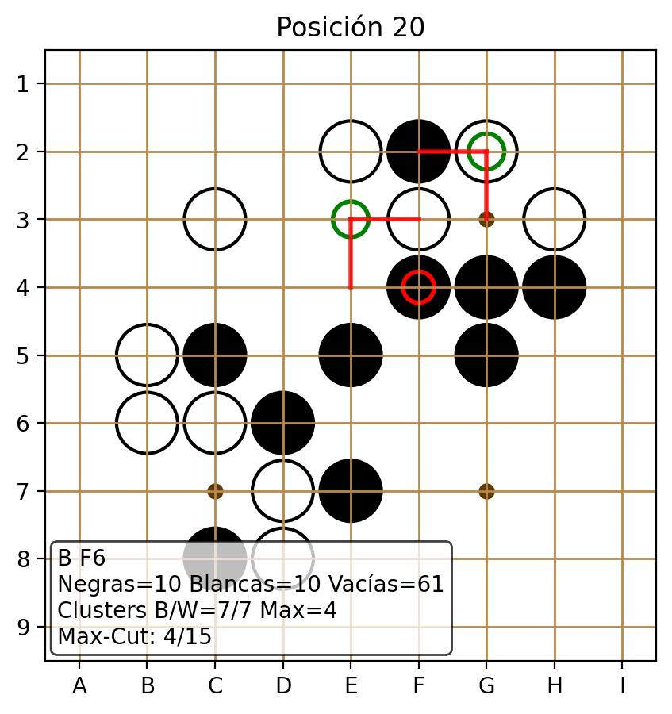
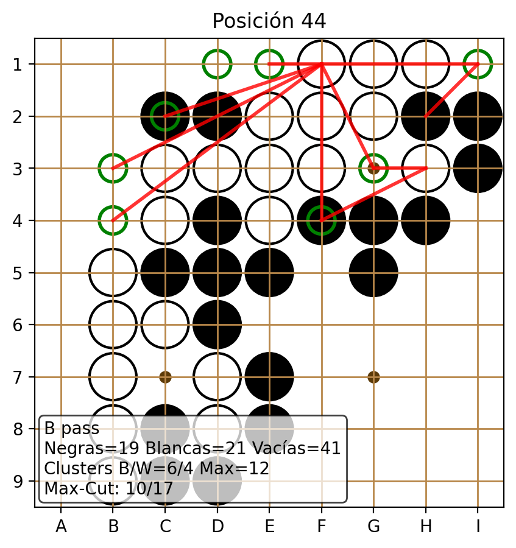

# Xanadu Go Quantum Toolkit

Toolkit modular para analizar partidas de Go (incluyendo tableros 9×9) mediante representaciones cuánticas, QAOA y extracción de *features* fotónicas.

## Capacidades principales

- **Ingesta SGF**: convierte partidas SGF en secuencias de tableros, aplica reglas de captura y expone metadatos. (`xanadu_go.sgf`)
- **Representaciones cuánticas**: genera FGR/CFG/RSF usando PennyLane y uniones de clusters basadas en expectativas cuánticas. (`xanadu_go.quantum_graph`)
- **Problemas combinatorios**: ejecuta QAOA para Max-Cut y Vertex Cover en grafos derivados del tablero, con incrustación automática de subgrafos. (`xanadu_go.qaoa`)
- **Modelos de referencia**: verifica Hamiltonianos de dos qubits y comparaciones clásicas/analíticas. (`xanadu_go.two_qubit`)
- **GBS y QML**: calcula *features* con Gaussian Boson Sampling (Strawberry Fields) y kernels cuánticos básicos. (`xanadu_go.gbs_features`, `xanadu_go.quantum_ml`)
- **Pipelines y visualización**: orquesta flujos SGF→features/QAOA y genera diagramas de tablero. (`xanadu_go.pipelines`, `xanadu_go.visualization`)

### ¿Qué analiza el sistema?

1. **Gráficos clásicos del tablero** (FGR, CFG, RSF) para cuantificar conectividad de grupos, libertades y subgrafos relevantes.
2. **Problemas de optimización** sobre esos grafos (Max-Cut/Vertex Cover) para identificar divisiones críticas y coberturas mínimas.
3. **Características fotónicas** que estiman densidad de subgrafos (Gaussian Boson Sampling).
4. **Verificación cuántica de Hamiltonianos** (modelo 2-qubit) para garantizar consistencia con la codificación.
5. **Visualizaciones** que combinan toda la información por jugada.

## Estructura del paquete

```
xanadu_go/
├── __init__.py          # API pública
├── quantum_graph.py     # Representación cuántica del tablero
├── qaoa.py              # Solvers Max-Cut / Vertex Cover
├── two_qubit.py         # Hamiltoniano de referencia 2-qubit
├── representations.py   # CFG y grafos ponderados clásicos
├── gbs_features.py      # Features con Gaussian Boson Sampling
├── quantum_ml.py        # Kernels y mapeos cuánticos
├── pipelines.py         # Orquestación (SGF, QAOA, GBS, QML)
├── sgf.py               # Parser SGF y evolución de tablero
├── circuit_viz.py       # Diagramas de circuitos QAOA e interferómetros GBS
└── visualization.py     # Grillas e imágenes del tablero
```

## Scripts y CLI

- `quantum_go_graph.py`: muestra el tablero base y el CFG generado por `QuantumGoGraph`.
- `quantum_go_xanadu.py`: ejecuta QAOA Max-Cut/Vertex Cover sobre FGR, CFG y RSF.
- `go_two_qubit_energy.py`: corre la verificación del modelo de dos qubits (`run_full_verification`).
- `analyze_sgf_game.py`: CLI para estudiar partidas completas jugada a jugada, reportando conteo de piedras, clusters CFG, QAOA y (opcionalmente) *features* GBS.

### Ejemplo de análisis SGF

```
python analyze_sgf_game.py --gbs-samples 5 --qaoa --qaoa-graph cfg \
    C:/Users/Leonardo/Downloads/80561510-044-barakeel-Oguchi.sgf
```

Salida: 45 posiciones (jugada 0–44) con métricas por turno. La bandera `--qaoa` habilita Max-Cut; para Vertex Cover se puede extender el script o cambiar `solve_problem_xanadu` a `problem="vertex_cover"`.

## Flujo de trabajo

1. **Carga SGF** → `xanadu_go.sgf.load_sgf` produce `SGFGame` con movimientos y tableros.
2. **Conversión a grafos** → `QuantumGoGraph` deriva FGR y CFG cuánticos; `representations.py` genera CFG y grafos ponderados clásicos.
3. **Análisis cuántico** → QAOA (`xanadu_go.qaoa`) resuelve Max-Cut/Vertex Cover sobre subgrafos contraídos; `two_qubit.py` sirve como prueba de consistencia.
4. **Features fotónicas/QML** → `pipelines.py` conecta CFG con `gbs_features` y kernels cuánticos.
5. **Visualización** → `visualization.py` crea figuras (por ejemplo `sgf_opening.png`) para revisar secuencias de jugadas.

## Uso de cómputo cuántico / QPU

- **PennyLane dispositivos**: por defecto se usa el simulador `default.qubit`. Para ejecutar en hardware Xanadu (ej. Borealis o X8) o proveedores remotos, reemplaza el `device_name` en `QuantumGoGraph`, `GoGraphAdvancedXanadu` o las funciones QAOA por un dispositivo soportado (`qml.device("strawberryfields.remote", wires=...)`, `qml.device("braket.aws.qubit", ...)`, etc.). Requiere credenciales/API key del proveedor.
- **Gaussian Boson Sampling**: `gbs_features.py` usa Strawberry Fields. Con el backend fotónico local (`sf.Engine("gaussian")`) funciona como simulador; para QPU (`sf.RemoteEngine("borealis")`) se deben configurar los tokens (`~/.config/strawberryfields/config.toml`). El pipeline degrada elegantemente si el backend no devuelve muestras (registra `samples=0`).
- **Costo de hardware**: ejecutar en QPU implica colas y posibles límites de disparos; ajustar `samples`, `depth` y `max_nodes` para mantenerse dentro de los recursos disponibles.

## Dependencias

```
conda activate Xanadu
pip install pennylane networkx matplotlib
pip install strawberryfields          # requerido para GBS y fotónica
pip install pennylane-qchem           # opcional para extensiones químicas
```

Se recomienda `pennylane>=0.42`, `autoray>=0.6.3` (ya resuelto en el entorno). Para visualización, Matplotlib genera *plots* en disco (`Agg`).

## Ejemplos rápidos

```
# Tablero base y CFG
python quantum_go_graph.py

# QAOA por grafo
python quantum_go_xanadu.py

# Modelo 2-qubit
python go_two_qubit_energy.py

# Análisis SGF completo
python analyze_sgf_game.py --qaoa C:/ruta/partida.sgf
```

## Resultados visuales

- `sgf_opening.png`: generado con `xanadu_go.visualization.plot_board_sequence`, muestra las primeras 11 jugadas del SGF de ejemplo. Se pueden crear animaciones o cuadros adicionales combinando `visualization.py` con Matplotlib/FFmpeg.
- Carpeta `visual_reports_9x9/`: colección completa (45 imágenes) del análisis jugada a jugada para el SGF 9×9 `80561510-044-barakeel-Oguchi.sgf`. Cada archivo `move_XXX.png` incluye:
  - El tablero 9×9 en la posición correspondiente (inicio hasta jugada 44).
  - Jugada más reciente resaltada en rojo.
  - Nodos seleccionados por QAOA Max-Cut en verde y aristas cortadas en rojo.
  - Resumen textual con conteo de piedras, estadísticas CFG y resultado del corte.





- `visual_reports_9x9/qaoa_circuit.png`: diagrama de compuertas generado con `xanadu_go.circuit_viz.draw_qaoa_circuit`. Presenta las capas Hadamard iniciales, los términos de costo (interacciones ZZ) y el mezclador X que el QPU ejecuta por cada iteración del algoritmo. La figura corresponde a la posición 20 del SGF 9×9 y ayuda a visualizar la secuencia exacta de operaciones que produce los nodos resaltados en verde en las imágenes anteriores.
- `visual_reports_9x9/gbs_interferometer.png`: mapa de calor de la matriz de adyacencia empleada por el interferómetro GBS (`plot_gbs_interferometer`). Cada celda representa el acoplamiento entre nodos del CFG; al enviarse a un fotónico remoto, esta matriz define la configuración de beamsplitters y fases del interferómetro.

Ejemplo de uso:

```
python analyze_sgf_game.py --qaoa --qaoa-graph cfg \
    --plot-dir visual_reports_9x9 --plot-prefix move_ --plot-dpi 200 \
    C:/Users/Leonardo/Downloads/80561510-044-barakeel-Oguchi.sgf
```

Esto genera `visual_reports_9x9`, la cual puede incorporarse a presentaciones o informes (por ejemplo, creando un PDF con `ffmpeg` o `convert`).

## Detalles algorítmicos

### Max-Cut y Vertex Cover

- **Max-Cut**: dado un grafo $G=(V,E)$ con nodos representando intersecciones relevantes del tablero (FGR/CFG/RSF), buscamos una bipartición $V = S \cup \bar{S}$ que maximice las aristas entre ambos conjuntos. Matemáticamente se optimiza

$$
\max \sum_{(i,j)\in E} \frac{1 - z_i z_j}{2}
$$

donde $z_i \in \{-1, +1\}$ denota el lado asignado al nodo $i$. En Go, un corte grande identifica bordes tensos entre grupos negros y blancos.

- **Vertex Cover**: persigue un subconjunto mínimo de nodos que cubra todas las aristas ($u$ u $v$ está en el conjunto para toda arista $(u,v)$). Esto modela los puntos que controlan interacciones críticas en el tablero.

### QAOA (Quantum Approximate Optimization Algorithm)

1. **Construcción del Hamiltoniano**: para Max-Cut usamos el operador $H_C = \sum_{(i,j)} (1 - Z_i Z_j)/2$. Para Vertex Cover, transformamos el QUBO asociado al problema y lo traducimos a un Hamiltoniano de Pauli-$Z$ (ver `_qubo_hamiltonian`).
2. **Estado inicial**: superposición uniforme con Hadamards sobre todas las qubits/wires.
3. **Capas alternas**: aplicamos `depth` capas donde:
   - Se evoluciona bajo $H_C$ (
`qml.qaoa.cost_layer`).
   - Se aplica un mezclador transversal ($\sum_i X_i$) (
`qml.qaoa.mixer_layer`).
4. **Optimización clásica**: un optimizador gradiente (por defecto `GradientDescentOptimizer`) ajusta los ángulos $\beta, \gamma$ para minimizar la energía esperada. Cada evaluación invoca a PennyLane para ejecutar el circuito en el dispositivo configurado.
5. **Medición**: el bitstring más probable tras las capas indica la solución candidata (conjunto de nodos en el corte/cobertura). Es el conjunto destacado en verde en las imágenes.

La figura `qaoa_circuit.png` es la representación gráfica de estas cinco etapas para un corte en la posición 20 del SGF. Cada caja ZZ muestra el término del Hamiltoniano que el QPU simula/ejecuta, mientras que las cajas RX corresponden al mezclador transversal.

### Gaussian Boson Sampling (GBS)

- Se construye una matriz de adyacencia ponderada a partir del CFG (o grafos derivados).
- Strawberry Fields calcula el estado gaussiano asociado (`subgraph.density_matrix`).
- **Muestreo fotónico**: `subgraph.sample` selecciona subgrafos densos (patrones de clicks) de tamaño `node_count`. Con hardware Borealis, esto corresponde a disparar pulsos fotónicos reales; en simulador se imita numéricamente.
- Las estadísticas (`samples`, `avg_size`) resumen cuántos subgrafos densos se hallaron. Actualmente se imprimen en la sección numérica de cada jugada (cuando no se obtienen muestras, se reporta `0`).

## Momento en que interviene el QPU

- **Durante QAOA**: cada evaluación de la energía y las probabilidades (cost/prob qnodes) se ejecuta sobre el dispositivo especificado. Si se configura `qml.device("braket.aws.qubit", ...)` o `qml.device("strawberryfields.remote", ...)`, estas evaluaciones se despachan a un QPU real. Las imágenes reflejan los resultados de esas ejecuciones: los nodos verdes y aristas rojas corresponden al bitstring óptimo obtenido del hardware (o simulador).
- **Durante GBS**: si `subgraph.sample` se ejecuta sobre `sf.RemoteEngine("borealis")`, las muestras fotónicas provienen directamente del QPU fotónico. Las métricas indicadas en el texto (muestras / tamaño medio) provienen de esas corridas.

En ambos casos, la elección de QPU se controla por configuración. En nuestra ejecución, los ejemplos se generaron sobre `default.qubit` (simulador), pero el README detalla cómo sustituirlo por un backend cuántico real.

La matriz representada en `gbs_interferometer.png` es exactamente la que se cargaría al interferómetro fotónico. Sus entradas determinan la reflectividad y las fases de cada beamsplitter; por eso, analizar el mapa de calor permite intuir qué grupos del tablero inducen mayor interferencia.

## Próximos pasos

1. Ajustar los pipelines GBS para obtener muestras densas (explorar `node_count` y normalización de pesos).
2. Añadir exportación estructurada (CSV/JSON) del análisis SGF (`analyze_sgf_game.py`).
3. Incorporar tests unitarios y validaciones de reglas (ko, suicidio) para partidas SGF avanzadas.
